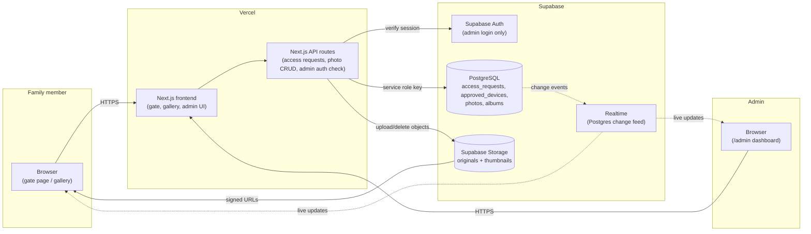
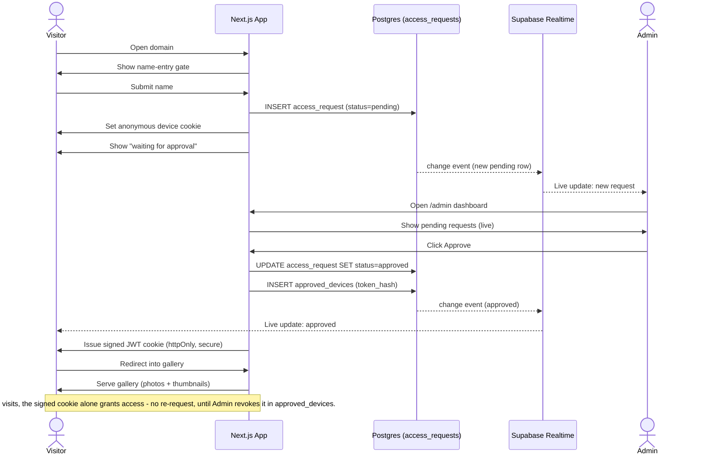
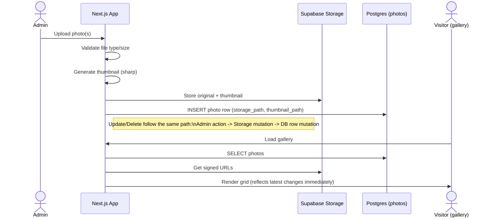

# Architecture

This document describes the planned system architecture and the end-to-end access-request/approval flow for the family photo gallery. See `CLAUDE.md` for the full plan and data model.

## System components

## Access-request → approval → gallery flow

## Photo management flow (admin)

