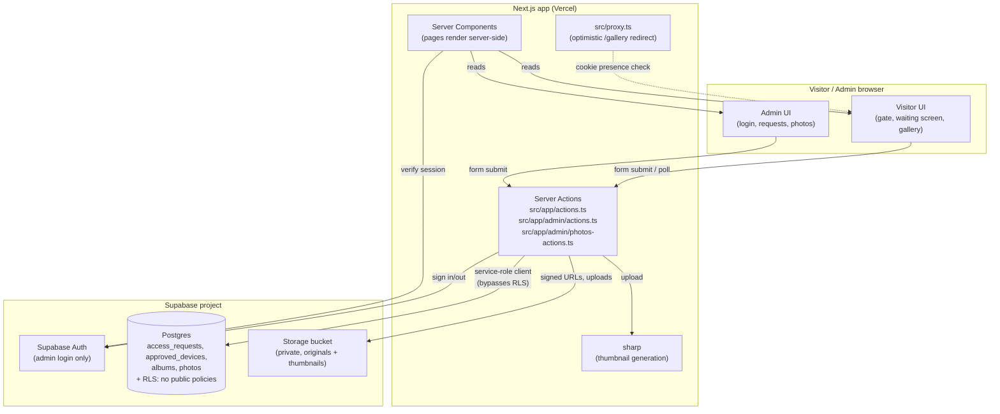
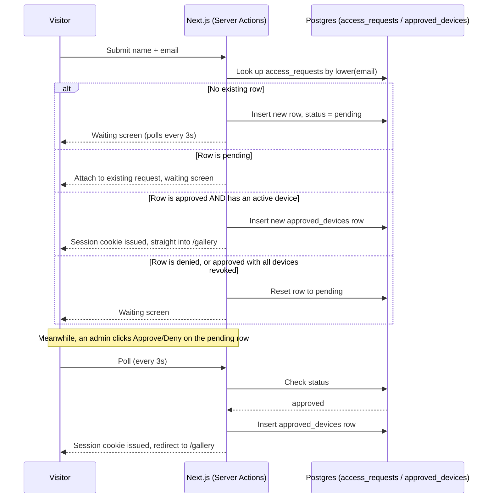

# Family Gallery

A private photo gallery for the family — no accounts, no passwords for visitors. Anyone who
knows the URL asks to get in with just their name and email; an admin approves or denies from a
separate dashboard; once approved, that email stays approved on every future visit (any device)
until the admin revokes it.

See `CLAUDE.md` for the authoritative, up-to-date design notes (read this first if you're an
agent working on the code). `ARCHITECTURE.md` and `TDD.md` are the original pre-implementation
planning docs — some details there (e.g. a REST API, Supabase Realtime) were superseded during
implementation; `CLAUDE.md`'s "Deviations from the original plan" section is the source of truth
for what actually shipped.

## Contents

- [What it does](#what-it-does)
- [Architecture](#architecture)
- [Tech stack](#tech-stack)
- [Project structure](#project-structure)
- [Data model](#data-model)
- [Visitor flow, step by step](#visitor-flow-step-by-step)
- [Security model](#security-model)
- [Local setup](#local-setup)
- [Build](#build)
- [Deploy](#deploy)
- [Known limitations](#known-limitations)
- [Commands](#commands)

## What it does

1. A visitor opens the site and is asked for their **name** and **email**.
2. Submitting creates a pending access request and shows a "waiting for approval" screen that
   polls for a decision every 3 seconds.
3. An admin, signed in separately at `/admin`, sees the request (name + email) and clicks
   **Approve** or **Deny**.
4. On approval, the visitor's browser is upgraded to a signed session cookie and redirected into
   `/gallery` — no further action needed on that device, ever, unless the admin revokes it later.
5. If that same **email** is submitted again later — a different browser, a different device, a
   cleared cookie — it's recognized immediately and skips the waiting screen entirely, as long as
   the admin hasn't revoked or denied it since. A denied or fully-revoked email goes back into the
   pending queue and needs a fresh decision.
6. Inside the gallery, visitors browse a photo grid with captions and a full-size lightbox
   viewer, and can **log out** of that browser (which doesn't revoke their approval — see
   [Visitor flow](#visitor-flow-step-by-step)).
7. The admin dashboard shows, per approved visitor: how many times they've visited, when they
   last visited (IST), and which device/browser they last used — and can revoke access with one
   click.
8. From a separate **Photos** tab, the admin uploads/capitons/deletes photos (JPEG/PNG/WebP,
   ≤25MB); a thumbnail is generated server-side on upload, and changes appear on the public
   gallery immediately.

## Architecture



Everything is one Next.js app deployed to Vercel; there is no separate backend service and no
public REST API. Every database read/write goes through a Server Action or a Server Component
using Supabase's **service-role key**, which bypasses Row Level Security — the anon/browser
client is never given direct table access, so RLS stays "deny everything" on every table (see
[Security model](#security-model)).

## Tech stack

| Layer | Technology | Why |
|---|---|---|
| Framework | Next.js 16 (App Router, Turbopack) | Server Components + Server Actions cover both UI and "API" in one app; no separate backend to deploy. |
| Language | TypeScript | End-to-end type safety, including generated Supabase row types (`src/types/database.ts`). |
| Styling | Tailwind CSS v4 | Utility classes, no separate CSS files per component. |
| Database | Supabase Postgres | Managed Postgres with Row Level Security, free tier viable at family scale. |
| File storage | Supabase Storage | S3-compatible; private bucket, objects served only via short-lived signed URLs. |
| Image processing | `sharp` | Server-side thumbnail generation (resize + WebP re-encode) on upload. |
| Admin auth | Supabase Auth (email/password) | Real credentials for the one privileged user role; separate from visitor "auth". |
| Visitor auth | Custom signed JWT (`jose`) in an httpOnly cookie | Not a real account system — a persistent, revocable device grant (see [Visitor flow](#visitor-flow-step-by-step)). |
| Validation | Zod | Form/schema validation shared between client hints and server-side enforcement. |
| Hosting | Vercel | Zero-ops deploys for the Next.js app; pairs naturally with Supabase for everything stateful. |

## Project structure

```
src/
├── app/
│   ├── page.tsx                    Visitor gate: name/email form, or waiting/denied screen
│   ├── layout.tsx                  Root HTML layout, fonts, global styles
│   ├── actions.ts                  Visitor Server Actions: submitNameRequest, pollAccessStatus, signOutVisitor
│   ├── gallery/page.tsx            The photo grid + lightbox; records a visit on every load
│   ├── admin/
│   │   ├── login/page.tsx          Admin sign-in page
│   │   ├── actions.ts              Admin auth + request actions: signIn/signOut, approve/deny, revokeAccess
│   │   ├── photos-actions.ts       Photo CRUD Server Actions: upload, updatePhotoCaption, deletePhoto
│   │   └── (dashboard)/
│   │       ├── layout.tsx          Admin shell: nav, signed-in email, sign-out button
│   │       ├── page.tsx            "Requests" tab: pending queue + approved visitors list
│   │       └── photos/page.tsx     "Photos" tab: upload form + photo grid
│   └── proxy.ts                    (Next.js 16's renamed middleware) optimistic /gallery cookie check
├── components/
│   ├── NameGateForm.tsx            Name + email form (client component, useActionState)
│   ├── WaitingScreen.tsx           Polls pollAccessStatus every 3s; redirects or shows "denied"
│   ├── GalleryGrid.tsx             Photo grid with captions; opens Lightbox on click
│   ├── Lightbox.tsx                Full-size photo viewer (prev/next, caption, Esc to close)
│   ├── CurrentDateTime.tsx         Live clock shown in the gallery header
│   ├── SignOutButton.tsx           Visitor "Log out" button (clears session cookie only)
│   └── admin/
│       ├── LoginForm.tsx           Email/password sign-in form
│       ├── AutoRefresh.tsx         Calls router.refresh() every 5s so the dashboard feels live
│       ├── PhotoUploadForm.tsx     File + caption upload form
│       ├── AdminPhotoGrid.tsx      Photo grid with inline caption editing + delete
│       └── SignOutButton.tsx       Admin sign-out button
├── lib/
│   ├── auth/
│   │   ├── visitor.ts              Visitor cookie issuance/verification, mintApprovedSession, recordGalleryVisit
│   │   └── admin.ts                verifyAdminSession() — Supabase Auth check for every admin page/action
│   ├── supabase/
│   │   ├── admin.ts                Service-role client (bypasses RLS) — the only way the app touches the DB
│   │   └── server.ts               Cookie-bound anon client, used only for Supabase Auth (admin login)
│   ├── photos.ts                   listGalleryPhotos (signed URLs), generateThumbnail (sharp)
│   ├── validation.ts               Zod schemas: name/email request, photo upload constraints
│   ├── rate-limit.ts               In-memory per-IP rate limiter
│   ├── format.ts                   formatIST() — IST date/time formatting for the admin dashboard
│   └── user-agent.ts               describeUserAgent() — best-effort "Chrome on Windows"-style label
└── types/
    └── database.ts                 Hand-written Supabase Database type (Row/Insert/Update per table)

supabase/
└── schema.sql                      Full DB schema: tables, indexes, RLS enablement, the
                                     record_gallery_visit() function — run this once per project
```

## Data model

All tables live in Postgres with Row Level Security **enabled and no public policies** — nothing
here is reachable from the browser directly, only through the service-role client on the server.

| Table | Columns | Notes |
|---|---|---|
| `access_requests` | `id, name, email, status (pending\|approved\|denied), device_cookie_id, created_at, decided_at, decided_by, visit_count, last_visited_at, last_user_agent` | **One row per email** (unique on `lower(email)`) — the identity anchor for the whole approval flow. `visit_count`/`last_visited_at`/`last_user_agent` are bumped atomically by the `record_gallery_visit()` SQL function on every gallery page load. |
| `approved_devices` | `id, access_request_id, token_hash, created_at, revoked_at` | One row per approved browser/device. Not unique on `access_request_id` — one email can have several active devices at once. `revoked_at` is the kill switch; the admin dashboard revokes all of a visitor's active rows in one click. |
| `albums` | `id, name, cover_photo_id, created_at` | Optional grouping for photos; not surfaced in the UI yet. |
| `photos` | `id, album_id, storage_path, thumbnail_path, caption, uploaded_at, uploaded_by` | One row per image; `storage_path`/`thumbnail_path` point at Storage objects served via signed URLs. |
| `admin_users` | — | Not a custom table — managed entirely by Supabase Auth. |

`supabase/schema.sql` is the single source of truth for all of this — run it once against a fresh
Supabase project and every table, index, and function above is created.

## Visitor flow, step by step



Once inside `/gallery`, every page load calls `record_gallery_visit()` (bumping `visit_count`,
`last_visited_at`, `last_user_agent`) and the visitor's session cookie is re-validated against
the `approved_devices` row on the server on every request — not just checked for a valid
signature — so an admin revoke takes effect on the visitor's very next request.

**Log out** (`signOutVisitor`) only clears the session cookie on that one browser; it does not
revoke the `approved_devices` row. If that person submits the same email again on the same
device, they're re-approved instantly. Only an admin **Revoke** or **Deny** forces a real
re-approval.

## Security model

- **RLS everywhere, no exceptions.** Every table has Row Level Security enabled with zero public
  policies. The only client that can read or write is the service-role client
  (`src/lib/supabase/admin.ts`), used exclusively on the server inside Server Actions/Components.
- **Rate limiting** on the one endpoint an anonymous stranger can hit — submitting a name/email
  (`src/lib/rate-limit.ts`, in-memory per-IP, good enough at family scale, not distributed).
- **Visitor sessions** are an httpOnly, secure (in production), SameSite=Lax JWT
  (`src/lib/auth/visitor.ts`), but the JWT signature alone is never trusted — every request also
  checks the corresponding `approved_devices` row hasn't been revoked, so revocation is instant
  rather than waiting for the token to expire.
- **Admin routes and mutations** all call `verifyAdminSession()` (a real Supabase Auth session
  check) themselves — every admin Server Action re-verifies independently rather than trusting
  that the UI only shows admin controls to admins.
- **Uploads** are validated for MIME type and size (`ACCEPTED_IMAGE_TYPES`, `MAX_UPLOAD_BYTES` in
  `src/lib/validation.ts`) before the file is handed to `sharp` or Storage.
- **`src/proxy.ts`** (Next.js 16's renamed `middleware.ts`) only does an *optimistic* redirect
  based on cookie *presence*, purely for UX (skip the flash of the gate page); it is not a
  security boundary — the real check happens server-side on every protected render regardless.

## Local setup

1. **Install dependencies**

   ```bash
   npm install
   ```

2. **Create a Supabase project** at [supabase.com](https://supabase.com).

3. **Run the schema** — open the SQL Editor in your Supabase project and run the entire contents
   of `supabase/schema.sql`.

4. **Create a storage bucket** named `gallery-photos` (Storage → New bucket), **private** (not
   public).

5. **Create an admin user** — Authentication → Users → Add user, with the email/password you'll
   sign in to `/admin` with.

6. **Configure environment variables** — copy `.env.example` to `.env.local` and fill in:

   | Variable | Where to find it |
   |---|---|
   | `NEXT_PUBLIC_SUPABASE_URL` | Project Settings → API |
   | `NEXT_PUBLIC_SUPABASE_ANON_KEY` | Project Settings → API |
   | `SUPABASE_SERVICE_ROLE_KEY` | Project Settings → API (keep secret — server-only) |
   | `SUPABASE_STORAGE_BUCKET` | `gallery-photos`, if you used the name above |
   | `VISITOR_JWT_SECRET` | Generate with `openssl rand -base64 32` |

7. **Run the dev server**

   ```bash
   npm run dev
   ```

   Visit `http://localhost:3000` for the visitor gate, `http://localhost:3000/admin/login` to
   sign in as admin.

## Build

```bash
npm run lint    # ESLint
npm run build   # Production build (Turbopack) — type-checks the whole project
npm start       # Serve the production build locally, for a final smoke test
```

Both `lint` and `build` are expected to pass cleanly before merging any change.

## Deploy

The app is designed for **Vercel (app) + Supabase (everything stateful)**, and isn't deployed
anywhere yet as of this writing.

1. **Push this repo to GitHub** (if not already) and import it into
   [Vercel](https://vercel.com/new).
2. **Use a dedicated Supabase project for production** — don't point production at your local dev
   project. Repeat steps 2–5 of [Local setup](#local-setup) against that project (run
   `supabase/schema.sql`, create the `gallery-photos` bucket, create the admin user).
3. **Set environment variables in Vercel** — Project → Settings → Environment Variables — the
   same five keys from the table above, using the *production* Supabase project's values. Set
   `VISITOR_JWT_SECRET` to a freshly generated secret, not the one from local dev.
4. **Deploy.** Vercel builds with `npm run build` automatically on every push to the connected
   branch.
5. **Verify end to end**: submit a name/email on the deployed URL, approve it from
   `/admin` on the same deployment, confirm the gallery loads, then upload a test photo from
   `/admin/photos` and confirm it appears on the public gallery.
6. **Custom domain** (optional) — add it under Vercel's Domains settings; no app changes needed,
   since cookies are set without a hardcoded domain.

Because visitor cookies are marked `secure` only when `NODE_ENV === "production"`
(`src/lib/auth/visitor.ts`), local dev over plain HTTP keeps working while the deployed site gets
proper secure cookies automatically — no environment-specific code changes needed.

## Known limitations

These are deliberate simplifications, not oversights — see `CLAUDE.md` for the full reasoning
behind each:

- **Polling, not Supabase Realtime**, for both the visitor waiting screen (3s) and the admin
  dashboard (5s refresh). Keeps every table unreachable from the browser; revisit only if the
  few-second latency actually becomes a problem.
- **In-memory rate limiting**, per serverless instance — a deterrent at family scale, not a
  distributed solution.
- **No test suite.** Correctness currently rests on `npm run build`/`npm run lint` plus manual
  verification.
- **Albums exist as a table but aren't exposed in the UI** — photos can be tagged with an
  `album_id`, but there's no album browsing view yet.

## Commands

| Command | Does |
|---|---|
| `npm run dev` | Start the dev server (Turbopack) |
| `npm run build` | Production build (verified passing) |
| `npm start` | Run the production build |
| `npm run lint` | ESLint (verified passing) |
